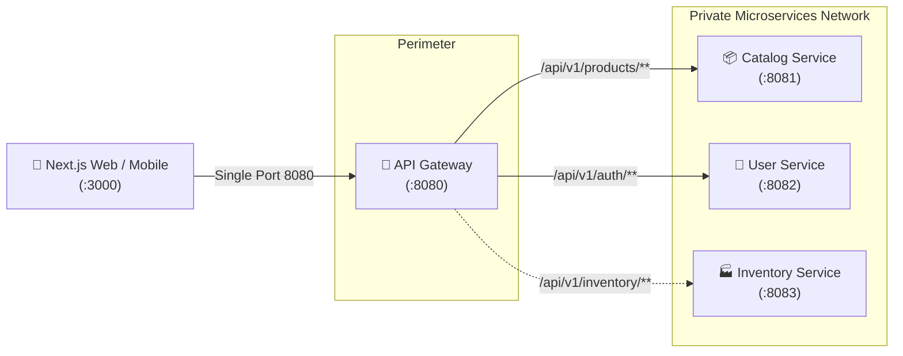
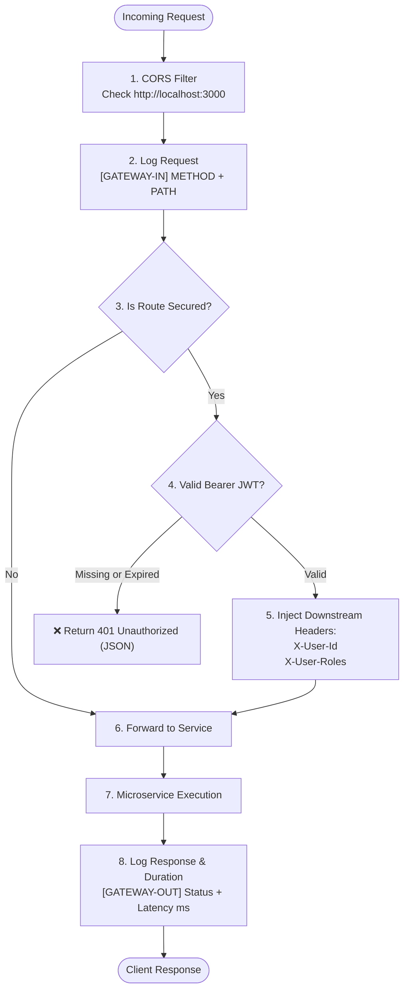
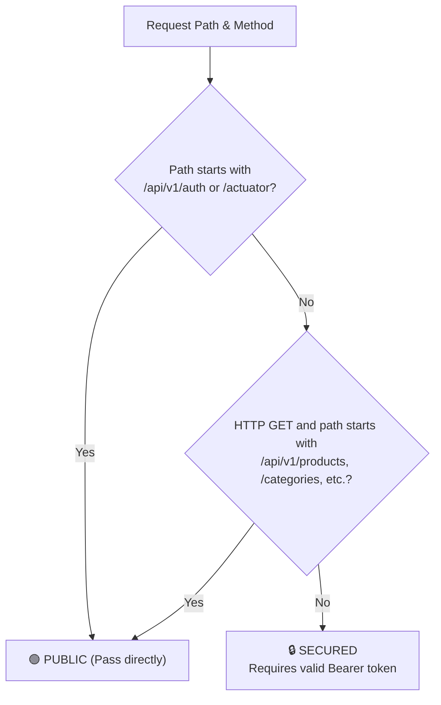
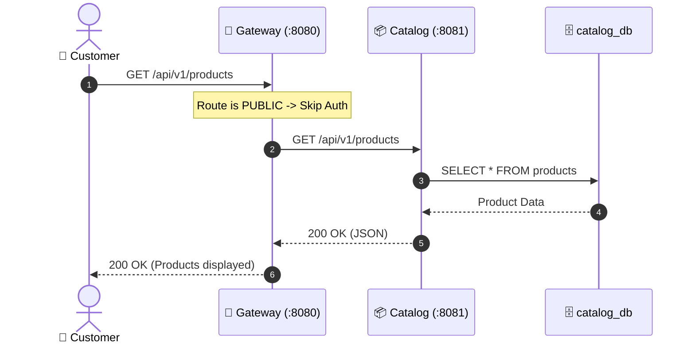
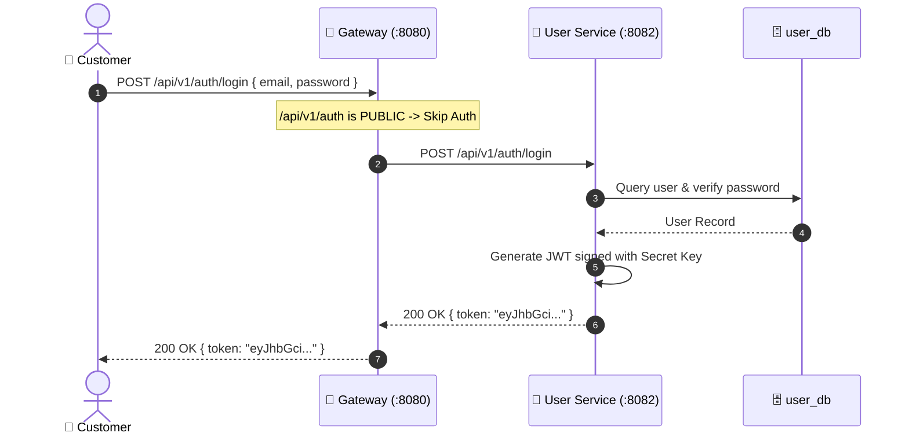
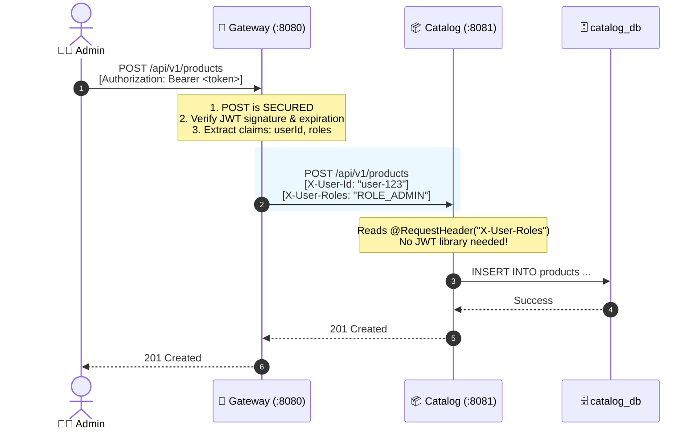
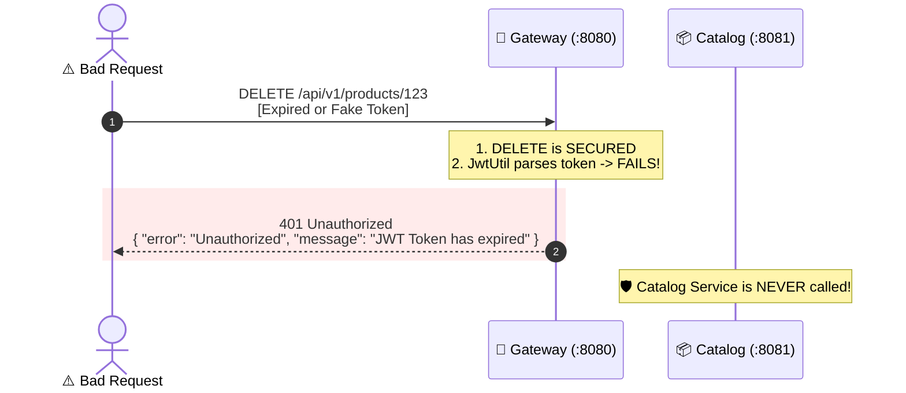

# 🔄 System Request Flow

Visual architectural guide for request routing from **Frontend** through **API Gateway** to **Backend Domains**.

---

## 1. 🗺️ Big Picture

---

## 2. ⚡ Gateway Internal Pipeline

What happens to every HTTP request inside `api-gateway`:

---

## 3. 🚦 Route Decision: Public vs Secured

How `RouterValidator` decides whether authentication is required:

---

## 4. 🛒 Scenario 1: Browsing Catalog (Public)

Anonymous user browsing products without login:

---

## 5. 🔑 Scenario 2: Login & Get Token

User logs in to receive a JWT:

---

## 6. 🛡️ Scenario 3: Admin Creates Product (Secured)

Admin performs write operation with token:

---

## 7. 🚫 Scenario 4: Expired or Bad Token (Rejected at Edge)

Bad token fails fast at Gateway without loading backend services:

---

## 8. 📋 Downstream Header Contract

What internal microservices receive from the Gateway:

| Header | Example Value | Usage in Microservice |
| :--- | :--- | :--- |
| `X-User-Id` | `a1b2c3d4-...` | `@RequestHeader("X-User-Id") String userId` |
| `X-User-Roles` | `ROLE_ADMIN,ROLE_CUSTOMER` | `@RequestHeader("X-User-Roles") String roles` |
