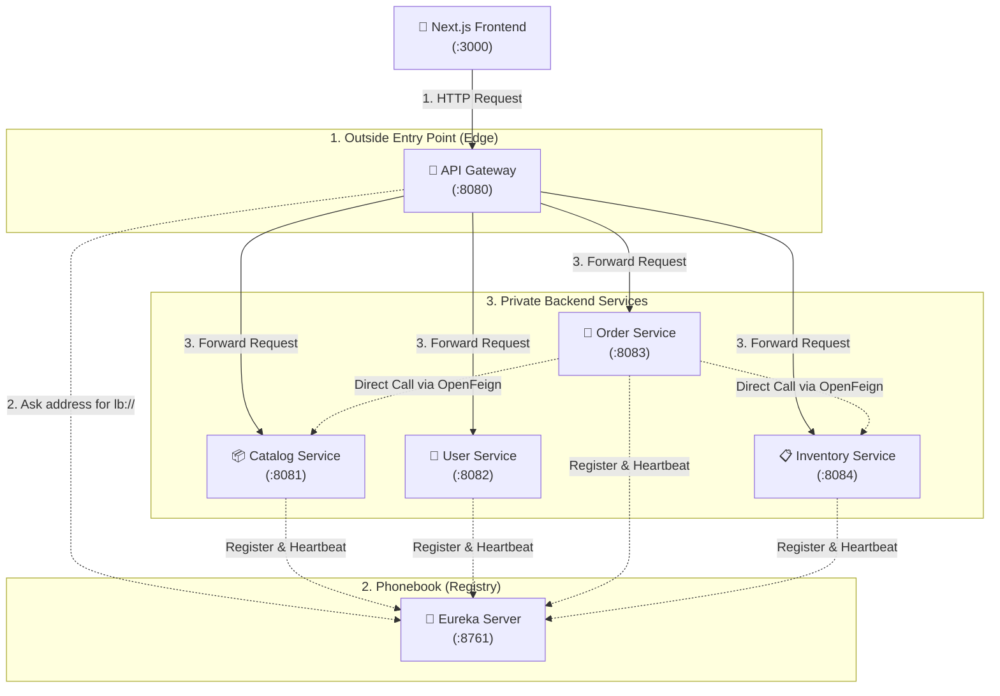
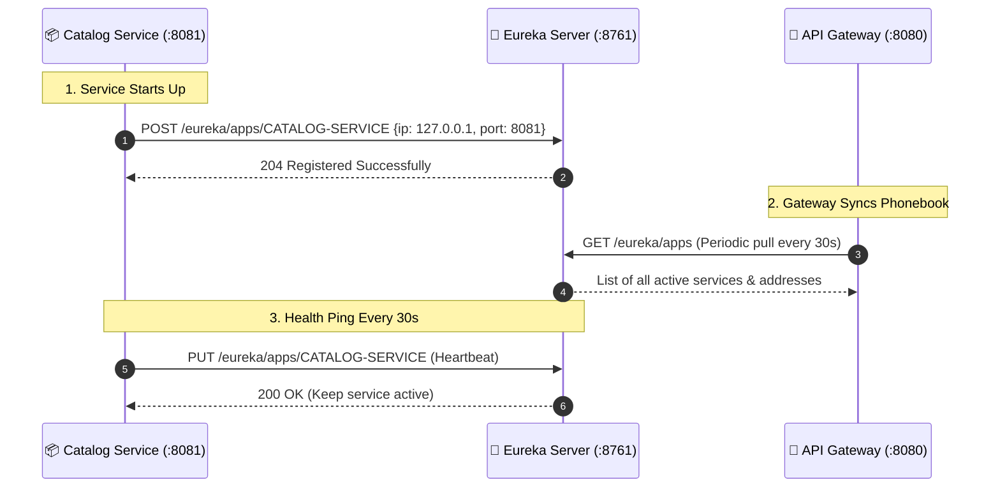
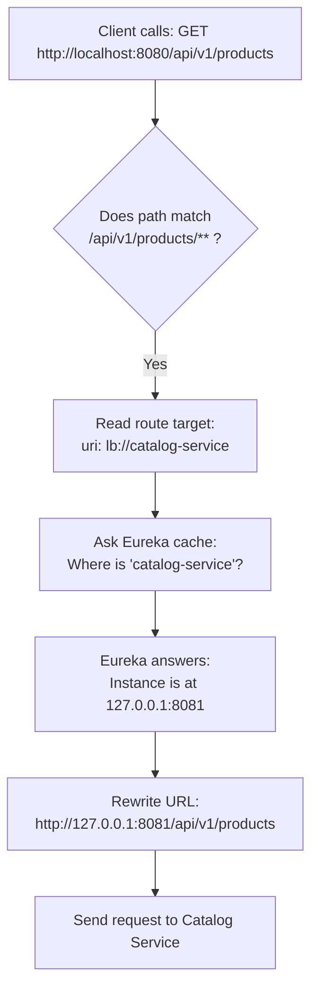
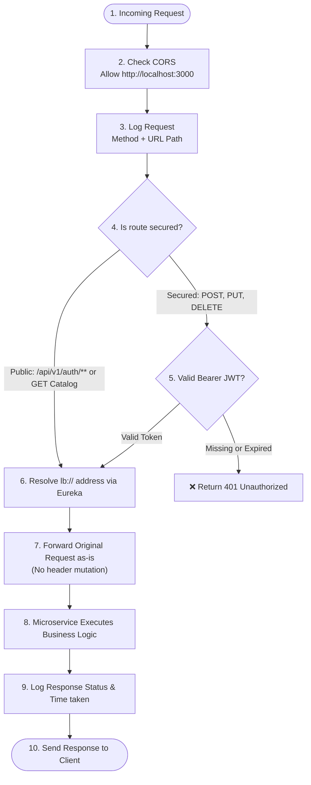
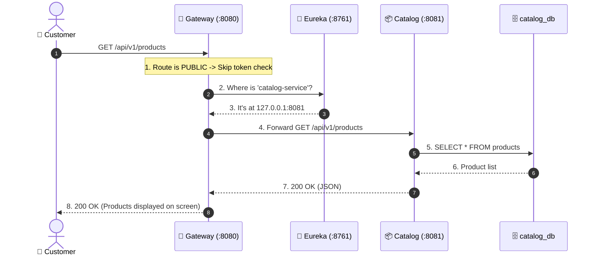
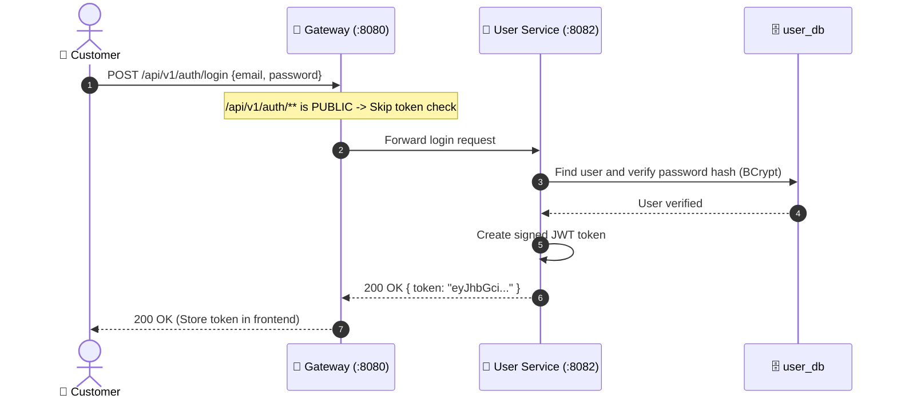
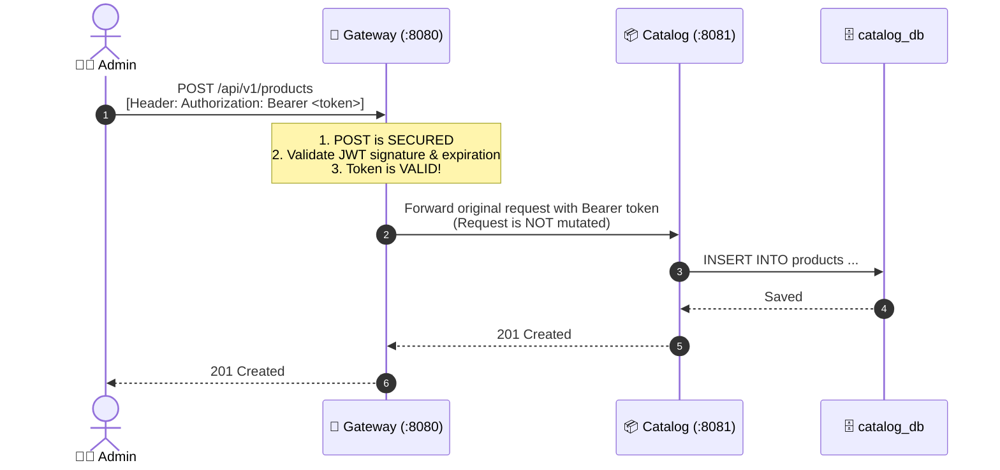
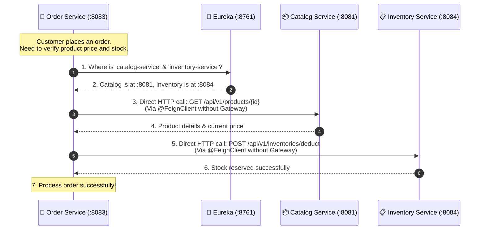

# 🔄 System Request Flow & Architecture Guide

A visual, step-by-step guide explaining how requests travel in the **eSupermarket** platform.

---

## 1. 🗺️ The Big Picture: Two Types of Traffic

In our microservices system, requests move in two ways:
1. **North-South (Outside to Inside):** Next.js sends requests through **API Gateway** to reach backend services.
2. **East-West (Inside to Inside):** Microservices talk directly to each other using **OpenFeign** and **Eureka**, without going through the Gateway.

```mermaid
flowchart TD
    Client["📱 Next.js Frontend\n(:3000)"]
    
    subgraph Edge ["1. Outside Entry Point (Edge)"]
        GW["🚪 API Gateway\n(:8080)"]
    end

    subgraph Discovery ["2. Phonebook (Registry)"]
        EUK["🧭 Eureka Server\n(:8761)"]
    end

    subgraph Internal ["3. Private Backend Services"]
        CS["📦 Catalog Service\n(:8081)"]
        US["👤 User Service\n(:8082)"]
        OS["🛒 Order Service\n(:8083)"]
        IS["📋 Inventory Service\n(:8084)"]
    end

    %% North-South Traffic
    Client -->|1. HTTP Request| GW
    GW -.->|2. Ask address for lb://| EUK
    GW -->|3. Forward Request| CS
    GW -->|3. Forward Request| US
    GW -->|3. Forward Request| OS
    GW -->|3. Forward Request| IS

    %% East-West Traffic
    OS -.->|Direct Call via OpenFeign| CS
    OS -.->|Direct Call via OpenFeign| IS

    %% Service Registration
    CS -.->|Register & Heartbeat| EUK
    US -.->|Register & Heartbeat| EUK
    OS -.->|Register & Heartbeat| EUK
    IS -.->|Register & Heartbeat| EUK
```

---

## 2. 🧭 How Eureka Works (The System Phonebook)

Think of **Eureka Server** as the phonebook of the entire backend:
1. When a service starts, it calls Eureka: *"Hello, I am `CATALOG-SERVICE` running at `127.0.0.1:8081`"*.
2. Every 30 seconds, it sends a heartbeat to say *"I am still alive"*.
3. Other services download this phonebook to know where to send requests.

```mermaid
sequenceDiagram
    autonumber
    participant CS as 📦 Catalog Service (:8081)
    participant EUK as 🧭 Eureka Server (:8761)
    participant GW as 🚪 API Gateway (:8080)

    Note over CS: 1. Service Starts Up
    CS->>EUK: POST /eureka/apps/CATALOG-SERVICE {ip: 127.0.0.1, port: 8081}
    EUK-->>CS: 204 Registered Successfully

    Note over GW: 2. Gateway Syncs Phonebook
    GW->>EUK: GET /eureka/apps (Periodic pull every 30s)
    EUK-->>GW: List of all active services & addresses

    Note over CS,EUK: 3. Health Ping Every 30s
    CS->>EUK: PUT /eureka/apps/CATALOG-SERVICE (Heartbeat)
    EUK-->>CS: 200 OK (Keep service active)
```

---

## 3. 🔍 How API Gateway Finds Services (`lb://`)

The Gateway maps incoming URLs to logical service names configured in `spring.application.name`:

```mermaid
flowchart TD
    Req["Client calls: GET http://localhost:8080/api/v1/products"] --> Match{"Does path match\n/api/v1/products/** ?"}
    
    Match -->|Yes| Find["Read route target:\nuri: lb://catalog-service"]
    Find --> Lookup["Ask Eureka cache:\nWhere is 'catalog-service'?"]
    Lookup --> Answer["Eureka answers:\nInstance is at 127.0.0.1:8081"]
    Answer --> Rewrite["Rewrite URL:\nhttp://127.0.0.1:8081/api/v1/products"]
    Rewrite --> Forward["Send request to Catalog Service"]
```

---

## 4. ⚡ Gateway Request Pipeline (Step-by-Step)

What happens to every incoming request inside `api-gateway`:

```mermaid
flowchart TD
    In(["1. Incoming Request"]) --> CORS["2. Check CORS\nAllow http://localhost:3000"]
    CORS --> LogIn["3. Log Request\nMethod + URL Path"]
    LogIn --> CheckSec{"4. Is route secured?"}
    
    CheckSec -->|Public: /api/v1/auth/** or GET Catalog| Resolve["6. Resolve lb:// address via Eureka"]
    CheckSec -->|Secured: POST, PUT, DELETE| CheckToken{"5. Valid Bearer JWT?"}
    
    CheckToken -->|Missing or Expired| Reject["❌ Return 401 Unauthorized"]
    CheckToken -->|Valid Token| Resolve
    
    Resolve --> Forward["7. Forward Original Request as-is\n(No header mutation)"]
    Forward --> RunService["8. Microservice Executes Business Logic"]
    RunService --> LogOut["9. Log Response Status & Time taken"]
    LogOut --> Done(["10. Send Response to Client"])
```

---

## 5. 🛒 Scenario 1: Customer Browses Products (Public Route)

No login or token needed to view products:

```mermaid
sequenceDiagram
    autonumber
    actor Customer as 👤 Customer
    participant GW as 🚪 Gateway (:8080)
    participant EUK as 🧭 Eureka (:8761)
    participant CS as 📦 Catalog (:8081)
    participant DB as 🗄️ catalog_db

    Customer->>GW: GET /api/v1/products
    Note over GW: 1. Route is PUBLIC -> Skip token check
    GW->>EUK: 2. Where is 'catalog-service'?
    EUK-->>GW: 3. It's at 127.0.0.1:8081
    GW->>CS: 4. Forward GET /api/v1/products
    CS->>DB: 5. SELECT * FROM products
    DB-->>CS: 6. Product list
    CS-->>GW: 7. 200 OK (JSON)
    GW-->>Customer: 8. 200 OK (Products displayed on screen)
```

---

## 6. 🔑 Scenario 2: User Logs In (Get JWT Token)

User exchanges email and password for a JWT token:

```mermaid
sequenceDiagram
    autonumber
    actor Customer as 👤 Customer
    participant GW as 🚪 Gateway (:8080)
    participant US as 👤 User Service (:8082)
    participant DB as 🗄️ user_db

    Customer->>GW: POST /api/v1/auth/login {email, password}
    Note over GW: /api/v1/auth/** is PUBLIC -> Skip token check
    GW->>US: Forward login request
    US->>DB: Find user and verify password hash (BCrypt)
    DB-->>US: User verified
    US->>US: Create signed JWT token
    US-->>GW: 200 OK { token: "eyJhbGci..." }
    GW-->>Customer: 200 OK (Store token in frontend)
```

---

## 7. 🛡️ Scenario 3: Admin Adds a Product (Secured Route)

Write requests require a valid Bearer token. Gateway validates the token and passes the original request:

```mermaid
sequenceDiagram
    autonumber
    actor Admin as 👨‍💼 Admin
    participant GW as 🚪 Gateway (:8080)
    participant CS as 📦 Catalog (:8081)
    participant DB as 🗄️ catalog_db

    Admin->>GW: POST /api/v1/products<br/>[Header: Authorization: Bearer <token>]
    
    Note over GW: 1. POST is SECURED<br/>2. Validate JWT signature & expiration<br/>3. Token is VALID!
    
    GW->>CS: Forward original request with Bearer token<br/>(Request is NOT mutated)
    CS->>DB: INSERT INTO products ...
    DB-->>CS: Saved
    CS-->>GW: 201 Created
    GW-->>Admin: 201 Created
```

---

## 8. 🔗 Scenario 4: Service-to-Service Direct Call (OpenFeign)

Microservices talk directly to each other without passing through API Gateway:

```mermaid
sequenceDiagram
    autonumber
    participant OS as 🛒 Order Service (:8083)
    participant EUK as 🧭 Eureka (:8761)
    participant CS as 📦 Catalog Service (:8081)
    participant IS as 📋 Inventory Service (:8084)

    Note over OS: Customer places an order.<br/>Need to verify product price and stock.
    OS->>EUK: 1. Where is 'catalog-service' & 'inventory-service'?
    EUK-->>OS: 2. Catalog is at :8081, Inventory is at :8084
    OS->>CS: 3. Direct HTTP call: GET /api/v1/products/{id}<br/>(Via @FeignClient without Gateway)
    CS-->>OS: 4. Product details & current price
    OS->>IS: 5. Direct HTTP call: POST /api/v1/inventories/deduct<br/>(Via @FeignClient without Gateway)
    IS-->>OS: 6. Stock reserved successfully
    Note over OS: 7. Process order successfully!
```

---

## 9. 📋 Summary Cheat Sheet

| Component | Port | Main Job | Swagger UI / OpenAPI Docs |
| :--- | :--- | :--- | :--- |
| **Eureka Server** | `8761` | Live phonebook where all microservices register their IP and port. | `http://localhost:8761` (Dashboard) |
| **API Gateway** | `8080` | Front door for Next.js. Checks JWT tokens and routes requests via `lb://`. | Bypasses `/v3/api-docs` & `/swagger-ui` |
| **Catalog Service** | `8081` | Manages products, categories, brands, tags, and images. | `http://localhost:8081/swagger-ui.html` |
| **User Service** | `8082` | Handles user accounts, passwords, login, and JWT tokens. | `http://localhost:8082/swagger-ui.html` |
| **Order Service** | `8083` | Handles checkout, VietQR SePay payments, and revenue analytics. | `http://localhost:8083/swagger-ui.html` |
| **Inventory Service** | `8084` | Manages warehouse stock levels, low-stock alerts, and stock deductions. | `http://localhost:8084/swagger-ui.html` |
| **OpenFeign** | *Library* | Lets backend services call each other directly using Eureka names. | N/A |

